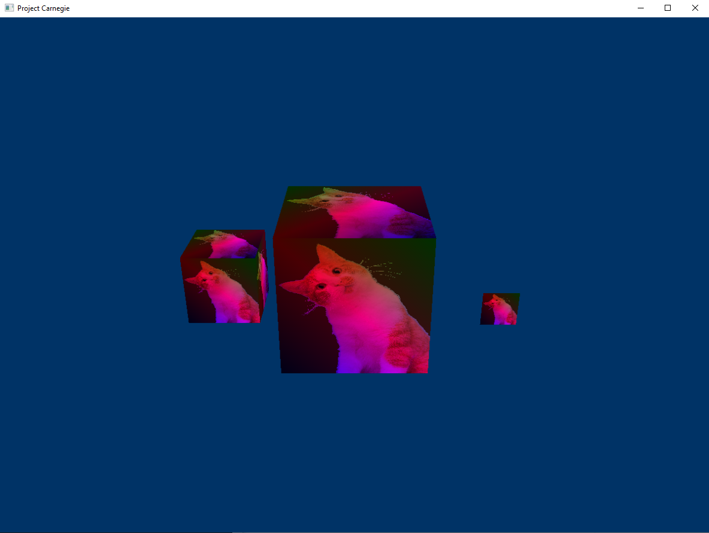
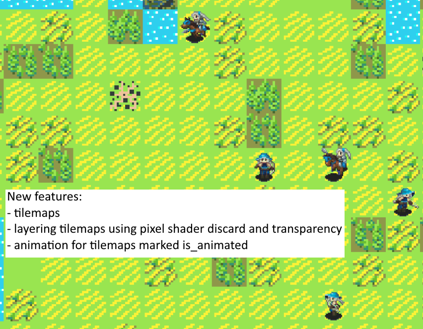

# carnegie (Aug 2020 - Jan 2021)

Originally when I was learning DX12 API I followed examples that produced 3D images.

End result of DX12 tutorials: Oct 16:


But I wanted to make a 2D tilemap system, so I implemented that and began iterating on it. This google doc explains the shader technique I used and some of the surrounding vocabulary. Its accurate to the first video and second screenshot.
https://docs.google.com/document/d/1knAz5btbuFTvYX5yFg6tosZ_1g7FeHanlujyFwCRAWI/edit?usp=sharing

Animation first working: Nov 10: https://youtu.be/KzrKdUyHgr4

Basic features of tileset, layers and units complete: Nov 24:


After I had the tilemaps, layering, and animation working, I wanted to allow the user to move one of the characters around with the keyboard.
I added movement between the tiles and then worked on making this movement prettier than just pressing a key and immediately having the character be in the next tile.

Lerping between tiles: Dec 6: https://youtu.be/RJPII_JdBQE

Moving character with user input and making the lerp smooth: Dec 15: https://youtu.be/MC1S00vQXRo

At the end I also added a system to have prettier terrain by using a "tiling tileset": Dec26:


At this point I had achieved most of my original goals for the project aside from replacing the use of discard in the pixel shader with blending.
I had also reached some major hurdles towards doing further development with the project. 
One being that DX12 is very verbose and requires a lot of (in my opinion) boilerplate code and memory management which was hampering my ability to iterate on the project
quickly, and this was pushing me to investigate DX11 which, while being an older API, I had heard it was much simpler to use than DX12 and its not like I was using any features 
of 12 that 11 did not have.
The other hurdle was that I wasn't the best at keeping consistent terminology throughout the codebase and so the C++ code and the HLSL code had become difficult to swap between the two sections of the program without becoming confused about where my data was going and what the code was doing. This wasn't helped by the fact that much of my original terminology sounded very similar to other terms in it: tilemap, tileset, tiledata, anim_frame, anim_time, something like 8 different things with index in the name...

I would say these hurdles and the project in general taught me some important lessons and skills:
1) Using an API designed for hyper-optimizing but is much more complicated vs one that is simple is a bad idea when your project is small and needs lots of experimentation.
2) It's important to keep consistent and clear naming.
3) Packing my game map data into an image to send it to the gpu taught me about how to manipulate memory in potentially unconventional ways to achieve a goal. In this case, the fact that the game map was a 2D grid and images are implicitly 2D grids with multiple variables per "grid location" meant I could render my game data cheaply, because the GPU is made to upload and store images and operate on those images efficiently.
4) The platform layer code taught by the handmadehero project's first ~15 episodes and my additions to that base code were also very useful and I'll be using it in future projects.

I've massively expanded this readme at this point which is funny cause its also my way of killing the project. I got a working system going and around the same time my interest in 2D kind of died out and I wanted to try working with 3D, along with switching to DX11 so I could spend more time writing my own code and less time wrangling an API, and sometimes a clean slate is nice. Maybe in the future I'll come back to this code and cut down all its rough edges so its just the tilemap rendering and game data stuff.

---
Requirements:
- Windows 10 SDK 10.0.19041.0
- A command prompt with MSVC x64 in path
- To compile and run
```
> build.bat
> run.bat
```
